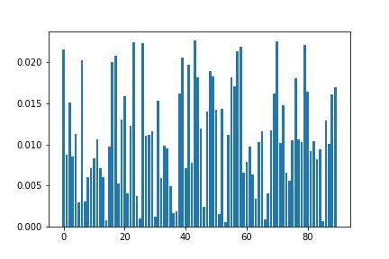
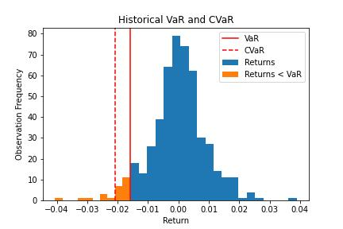

# Use CVaR to capture tail risk

How to compute the conditional value at risk (CVaR) of a portfolio of stocks.

This code calculates the value at risk (VaR) and the conditional value at risk (CVaR) of a portfolio made up of stocks in the S&P 100 index. The VaR and CVaR are calculated using the historical returns of the stocks in the portfolio.

VaR estimates how much your portfolio might lose over a set time. One of the caveats with VaR is it assumes the distribution of returns is normal, which it’s not. Another caveat is VaR assumes losses will not exceed the cutoff point, which they likely will.

## CVaR captures more information than VaR

CVaR is an **improvement** over VaR and is considered superior by practitioners. It takes into consideration the actual shape of the distribution and quantifies the tail risk. CVaR is also known as the expected shortfall since it measures the expectation of all the different possible losses greater than VaR.

Non-professional traders and investors should consider using CVaR over VaR for their own risk management.

---

Key Takeaways:

- Get stock data
- Compute VaR and CVaR
- Visualize the differences between the two

---

Import required libraries

    numpy

    pandas

    yfinance
    
   matplotlib
   
---

**File:** [CVaR](cVaR.ipynb)

---

## Step 1: Get stock data

Use 90 stocks in the S&P 100 index. Grab the data and compute the returns using the pct_change function.

    oex = ['MMM','T','ABBV','ABT','ACN','ALL','GOOGL','GOOG','MO','AMZN','AXP','AIG','AMGN','AAPL','BAC',
           'BRK-B','BIIB','BLK','BA','BMY','CVS','COF','CAT','CVX','CSCO','C','KO','CL','CMCSA',
           'COP','DHR','DUK','DD','EMC','EMR','EXC','XOM','META','FDX','F','GD','GE','GM','GILD',
           'GS','HAL','HD','HON','INTC','IBM','JPM','JNJ','KMI','LLY','LMT','LOW','MA','MCD','MDT','MRK',
           'MET','MSFT','MS','NKE','NEE','OXY','ORCL','PYPL','PEP','PFE','PM','PG','QCOM',
           'SLB','SPG','SO','SBUX','TGT','TXN','BK','USB','UNP','UPS','UNH','VZ','V','WMT',
           'WBA','DIS','WFC']
       

Create a mock portfolio by generating random weights and multiplying them by the returns. You can use your actual weights to represent your own portfolio.

**Visualize the random weights**

---

## Step 2: Compute VaR and CVaR

Start by building a function to compute VaR so you can compare it to CVaR.

**VaR**

- take in the value invested in the portfolio, 
- the returns of the stocks in the portfolio, 
- the weights of the stocks in the portfolio, 
- optional alpha value (which is set to 0.95 by default) 
- lookback period (which is set to 500 days by default). 

- Replace any NaNs with 0.0s in the DataFrame of returns. 
- Take the last few days of returns and multiply them by the portfolio weights to create portfolio returns. 
- Compute VaR by taking the 5th percentile of returns and multiplying it by the value invested. 
This gets the amount you can expect to lose in one day with 95% confidence.
It calculates the VaR of the portfolio by de-meaning the returns, 
multiplying the returns by the weights, and then finding the 
percentile value corresponding to the given alpha value. 
The VaR is then calculated as the product of this percentile value 
and the value invested in the portfolio.

This is the main difference between VaR and CVaR. VaR represents a worst-case loss associated with a probability and a time horizon. CVaR is the expected loss if that worst-case threshold is crossed. In other words, CVaR quantifies the expected losses that occur beyond the VaR cutoff. VaR only measures the cutoff.

**CVaR**

Similar to the value_at_risk() function, it calculates the CVaR instead of the VaR. It does this by first calculating the VaR of the portfolio using the value_at_risk() function, then finding the percentage loss of the portfolio returns that are below the VaR, and finally taking the mean of these returns and multiplying it by the value invested in the portfolio.

- Compute VaR to get the cutoff point on the distribution that equals the 5th percentile. 
- compute the portfolio returns and convert VaR back to a percentage instead of a dollar amount. 
- compute CVaR, take the average of all returns less than VaR and multiply by the invested value.

Taking the average of all returns less than VaR is the same as taking the area of the distribution left of that cutoff point.

---

## Step 3: Vizualize the difference between the two
Compute the CVaR and VaR of the portfolio and note the difference.

CVaR is a bigger negative number than VaR. The difference between the two is the extra information CVaR captures by taking the average of all returns less than VaR. If you are dependent on VaR for risk management, you miss that information.

If this still isn’t clear, a chart will help.

---

### Usage

To use this code, you will need to specify the value invested in the portfolio and the weights of the stocks in the portfolio. You can do this by defining the variables 'value_invested' and 'weights', respectively. For example:

    # assume you invested $100,000 in the portfolio
    value_invested = 100000  
    # assume equal weights for the 4 stocks in the portfolio
    weights = np.array([0.1, 0.2, 0.3, 0.4]) 
    
You can then call the value_at_risk() and cvar() functions to calculate the VaR and CVaR of the portfolio.

    var = value_at_risk(value_invested, returns, weights)
    cvar = cvar(value_invested, returns, weights)
    
The 'value_at_risk()' and 'cvar()' functions take several optional arguments:

'alpha': the confidence level for the VaR calculation (default is 0.95)
'lookback_days': the number of days of historical data to use for the VaR calculation (default is 500)
You can specify these arguments when you call the functions, as shown below:

    var = value_at_risk(value_invested, returns, weights, alpha=0.99, lookback_days=250)
    cvar = cvar(value_invested, returns, weights, alpha=0.99, lookback_days=250)